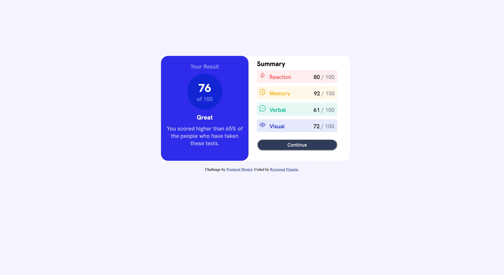

# Frontend Mentor - Results summary component solution

This is a solution to the [Results summary component challenge on Frontend Mentor](https://www.frontendmentor.io/challenges/results-summary-component-CE_K6s0maV). Frontend Mentor challenges help you improve your coding skills by building realistic projects. 

## Table of contents

  - [Screenshot](#screenshot)
  - [Links](#links)
- [My process](#my-process)
  - [Built with](#built-with)
  - [What I learned](#what-i-learned)
  - [Continued development](#continued-development)
  - [Useful resources](#useful-resources)
- [Author](#author)

### Screenshot




### Links

- Solution URL: [https://github.com/Rhyz26/results-summary-component-main.git](https://your-solution-url.com)
- Live Site URL: [https://results-summary-component-main-nine-sigma.vercel.app/](https://your-live-site-url.com)

## My process
I first developed this website using HTML, then proceeded to design CSS properties

### Built with

- Semantic HTML5 markup
- CSS custom properties
- Flexbox

### What I learned

I learned how to style each element amongst a multitude of elements, 

```html
<h1>Some HTML code I'm proud of</h1>

<div class="reaction">
          <p
            style="
              background-color: hsla(0, 100%, 67%, 0.1);
              width: 230px;
              border-radius: 5px;
              margin-bottom: 10px;
              padding: 6px;
            "
          >
            <span
              class="red"
              >Reaction</span
            >
            <span class="red-3">80 <span class="red-1">/ 100</span></span>
          </p>
        </div>
```


### Continued development
I would love to continue learning how to make the website responsive on the small screens 


### Useful resources

- [Example resource 1](https://www.w3schools.com) - This helped me for HTML and CSS. I really liked this pattern and will use it going forward.


## Author

- Website - [Raymond Njagala](https://personal-portfolio-web-cyan.vercel.app/)
- Frontend Mentor - [@Rhyz26](https://www.frontendmentor.io/profile/Rhyz26)
- Twitter - [@Initial_Rhy](https://www.twitter.com/Initial_Rhy)

